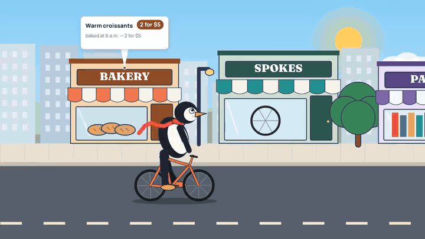

# code-reel

Original motion graphics and illustrated 2D animation, generated entirely in code.
An HTML canvas draws every frame deterministically, headless Chromium captures
it, ffmpeg encodes it, numpy writes the soundtrack from the same compiled events
— and every video's scenes are written for **that** video.


*(one pipeline, three videos: a storybook penguin ride with pop-up shop ads, a Swiss-style
product reel written by the director, and the original dark "signal" showreel)*

## What it is / isn't

**Is:** kinetic typography, data stories, product and UI walkthroughs, code,
diagrams, maps and routes, and flat 2D vector illustration — characters with
rigged limbs, vehicles, towns, props, camera moves through a parallax world,
graphics anchored to things in it. Seven style packs, eleven transitions, six
score presets, 16:9 / 9:16 / 1:1.

**Isn't:** photoreal footage, 3D renders, video-model output, lip-sync, or other
people's characters. If a brief needs those pixels, this is the wrong tool.

## Use it from an agent

```text
Use the code-reel skill (SKILL.md) to make me a 15 s video: <what it's for, who
it's for, the claims and their sources, the look>. Interview me first.
```
The agent runs the flow in `SKILL.md`: interview → brief → `init` (seed) →
treatments (it looks at the style frames) → timeline → one scene file per scene
(each gated, each looked at) → review → draft → final → QC. With a local model
instead: `--backend ollama --model <m>`; the prompts and gates are identical.

## Use it by hand

```bash
pip install -r requirements.txt && python -m playwright install chromium   # + ffmpeg on PATH
python3 reel.py init my-reel --seed 7 --style editorial
$EDITOR my-reel/brief.md my-reel/timeline.json my-reel/scenes/opening.js
python3 reel.py review my-reel          # contact sheet + layout audit + novelty + critique
open my-reel/.reel/index.html           # live preview: space, arrows, scrubber
python3 reel.py run my-reel --draft     # -> my-reel/reel.mp4 + .reel/qc_report.xlsx
```

## How it fits together

```
brief.md ─┐
claims.json ─┤          ┌─ .reel/timeline.js ──> index.html (engine + scenes) ──> Chromium ──> frames.mkv (FFV1, lossless)
timeline.json ─┼─ compile ─┤                                                                          │
scenes/*.js ─┘   (style,   └─ .reel/timeline.resolved.json ──> audio (score + sfx) ──> audio.wav     │
                 claims,                                  └──> qc / novelty                          ▼
                 events)                                               build: one lossy encode, BT.709, −14 LUFS loop ──> reel.mp4
```

- `compile` is the single source of truth: style pack expansion, claim resolution,
  scene contracts, and **all** timed events (cuts, transitions, hits, typing, ticks).
  The browser and the soundtrack read the same compiled events, so sync can't drift.
- `audit` records every piece of text the scene draws and fails overlaps, off-canvas
  text, blank scenes and JS errors (with file:line).
- `novelty` fingerprints each scene's layout and edges against the library of
  blueprints and past reels; a recolor of an old layout is flagged as a re-skin.
- `direct` drives the creative steps through one model interface — `agent`,
  `ollama`/`openai`, or `mock` — with identical prompts, file names and gates.

## Files

| path | what |
|---|---|
| `SKILL.md` | the flow an agent follows |
| `reel.py` | the only entry point (init, brand, compile, stills, audit, contact, novelty, review, render, audio, build, qc, run, direct, status) |
| `reelkit/` | compile, render, audio, build, qc, novelty, director, llm, brand |
| `engine/` | core primitives + audit hooks, looks (bg/hud/post/camera/transitions/shader), 16 blueprint scenes, illustration toolkit, player/preview, styles.json, scenes.json, fonts |
| `prompts/` | director prompts + rotating worked examples (identical for every backend) |
| `references/` | interview, api, scenes, styles, claims, director, critique, qc |
| `library/` | novelty fingerprints + their source timelines (`tools/build_library.py`) |
| `examples/penguin` | illustration acceptance test — penguin biking through town, pop-out ads per store |
| `examples/pi-small-core` | a director run by an agent, with its full prompt/answer transcript |
| `tests/` | pytest suite that drives `reel.py` exactly as an agent does |

## Tests

```bash
python3 -m pytest -q tests      # ~5 min; every test calls the CLI, not internals
```
Compile contracts, claims, seed variation, every style/bg/hud/post/camera/transition,
audio determinism and sync, layout-audit catches, vertical layouts, brand scanning,
examples in `--final`, an end-to-end render, and the director: a recorded agent
session (`tests/fixtures/pi_small_core`) replayed through the mock backend —
same prompts, same gates, same repair loop.
