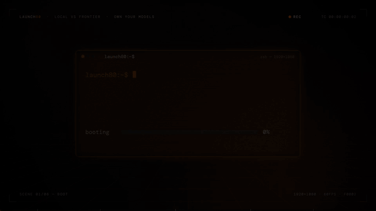

# code-reel

Motion-graphics videos generated entirely in code — no video editor, no After
Effects, no design files. An HTML canvas draws every frame deterministically,
headless Chromium captures at 60fps, ffmpeg encodes, and numpy synthesizes the
soundtrack from the same timeline that drives the animation.

**Example output** — 15s, 1080p60, generated from a single `timeline.json`
(15s GIF preview; the real MP4 is sharper and has audio):



## What this is / isn't

**Is**: a code-driven motion-graphics pipeline for launch reels, product promos
and data stories — kinetic type, terminals, stat cards, counters, charts,
quotes, splits, endcards — plus a deterministic cinematic post layer (ACES tone
mapping, shutter motion blur, bloom, grain, lens treatment) and an optional
local-LLM *director* that turns a written brief into a validated `spec.json`.
Every pixel comes from deterministic renderer code; the LLM never touches
pixels, only the spec.

**Isn't**: a general video generator. No illustration, no footage, no video
models, no photoreal humans — "a penguin riding a bicycle through town" is out
of scope. If a request needs pixels that aren't typography, charts, geometry
or procedural camera effects, this skill can't produce them. The skill repo's
README prompt deliberately advertises that boundary so users aren't surprised.

## Get started (paste this to your agent)

Paste this into any agent session that can run shell commands (Claude Code,
Codex, pi, OpenClaw, …). It installs the skill, sets up the environment, and
starts generating — replace the content block with your own topic, numbers, and
tagline:

```text
Set up the code-reel skill and make me a video:

0. First run the interview (references/interview.md): one round, 7
   questions, defaults on each — topic, platform, length, claims +
   sources, who writes the story, look, render plan. Echo the decision
   table back before building anything.

1. git clone https://github.com/launch80/code-reel.git ~/.agents/skills/code-reel
   (if it already exists, git pull instead). The skill is discovered at
   ~/.agents/skills/code-reel/SKILL.md — reload the session if needed.
2. Environment: cd ~/.agents/skills/code-reel/templates, create a venv, run
   pip install -r requirements.txt, python -m playwright install chromium,
   and make sure ffmpeg is on PATH (brew install ffmpeg if missing).
3. Build a 15s reel with the code-reel skill using this content:
   - Topic: local AI vs frontier/cloud AI — local wins on privacy, cost, control
   - Stats to feature: $312/yr frontier API vs $0 local; 100% of prompts local;
     300h+ frontier downtime per year; 2,000 community members
   - Kinetic words: PRIVATE. (0 uploads) / FREE. ($0/mo) / YOURS. (pinned forever)
   - End card: launch80 · "local ai, dialed in." · launch80.com
   Keep the template's 6-scene structure, cut times, and audio sync; only
   rewrite the content. Run validate.py first, then render PNG stills at DPR=1
   for a collision/overflow check, fix anything that looks wrong, then run the
   full DPR=2 build and hand me the final MP4.
```

The agent will interview you once (one message, defaults on every question —
answer "all defaults" to skip ahead), save your answers to `brief.md`, edit
`timeline.json` (the only file you touch), render stills for review, then
`./build.sh` → `reel.mp4` → `qc.py` (~15s, 1080p60, ~15 MB, ~11 min).

## Three ways to use it

| | Mode | Who writes the scenes | You do |
|---|---|---|---|
| **1** | **Director** | the **director LLM** — a local model (Ollama / vLLM / LM Studio / MLX) invents a `timeline.json` from your brief using the 8 shipped archetypes | paste a brief, review stills, approve |
| **2** | **Blueprints** | you + a local LLM, in `scene_custom.js` — new scene types as JS functions that *reference the skill's own blueprint code* (`REG` in `reel.html`) so the style stays consistent | ask your agent: “read `references/blueprints.md` + the REG in `reel.html`, write a new scene in `scene_custom.js`” |
| **3** | **Fill-in** | nobody — you fill the `<SLOT>`s in `templates/blank.json` | 30 seconds of typing; `validate.py` refuses to render while slots are unfilled |

All three converge on the same pipeline:

```
interview ──► brief ──> director.py ──> timeline.json ──> validate.py ──> render.py ──> audio.py ──> build.sh ──> reel.mp4 ──> qc.py
(1 round,    (mode 1)   (mode 2/3 edit     (contracts,    (stills       (derived     (single      (22 auto     (25 manual
 defaults)              here, or            beat grid,     first,        from the     lossy       tests,       tests
                         scene_custom.js)    slots)         then full)    same file)   encode)     xlsx)        pre-filled)
```

## QC — the 66-test discipline

`python3 qc.py reel.mp4 timeline.json` measures what a machine can measure
(tech specs, **color tags**, fast-start, black/freeze detection, EBU R128
loudness, A/V length match) and pre-fills the rest for a human with exact
timecodes (visual checks per scene, transitions, delivery, fact-check).
Output: `qc_report.md` + a 5-tab `qc_report.xlsx` (Summary · Test Sequence ·
Cue Sheet · Tech Specs · Fact Check). `READY TO PUBLISH?` only says yes when
the auto-tests are clean **and** a human has resolved every manual row.
See `references/qc.md`.

## How it works

```
timeline.json ──┬──> reel.html ──(Playwright, 60fps, 2x supersampled)──> frames.mkv (lossless FFV1)
                │                                                              │
                └──> audio.py ──(numpy/scipy: beats, risers, impacts)──> audio.wav
                                                                               │
                              build.sh ◄───────────────────────────────────────┘
                                 │  single lossy encode: Lanczos downscale,
                                 ▼  yuv420p, BT.709 tags, CRF 17
                              reel.mp4  (1080p60, 15s, ~15 MB)
```

One file — `timeline.json` — is the single source of truth. The reel is a list
of scenes (`terminal`, `kinetic`, `cards`, `counter`, `chart`, `quote`, `split`,
`endcard`); cut times, HUD scene labels, flash/shake impacts, and the entire
audio score (beats, risers, slams, typing clicks, counter ticks) are **derived**
from it. Recomposing a reel never requires touching drawing code.

## Manual quickstart (no agent)

```bash
cd templates
python3 -m venv .venv && source .venv/bin/activate
pip install -r requirements.txt
python -m playwright install chromium
# ffmpeg must be on PATH (brew install ffmpeg)

# playable preview in Chrome (space = play/pause, scrubber, audio)
open reel.html            # or: python3 -m http.server 8000 → http://localhost:8000

# quick frame checks (PNG, no full render)
python3 render.py stills 0.8,3.4,8.5

# validate the timeline, then full build
python3 validate.py
./build.sh
```

## Files

| File | Role |
|---|---|
| `templates/timeline.json` | **The reel.** Scenes, durations, content, theme, HUD. All timing lives here. |
| `templates/blank.json` | Mode 3: the same structure with `<SLOT>` placeholders — fill them, `validate.py` refuses to pass while any remain. |
| `templates/reel.html` | Player + scene registry + motion toolkit. Data-driven: reads the timeline (injected at render, fetched in preview). Also a standalone live preview with a scrubber. |
| `templates/render.py` | Captures frames via canvas `toDataURL` → lossless FFV1 `frames.mkv` (or PNG stills). `DPR` env = supersampling factor (default 2). |
| `templates/audio.py` | Synthesizes `audio.wav` from the timeline: beats at `bpm`, kick/hat/pad, risers at cuts, impacts at slams, typing clicks, counter ticks, bell. |
| `templates/events.py` | The single event derivation both audio and QC import — sync is by construction, not by luck. |
| `templates/validate.py` | Checks the timeline against the scene contracts: required params, beat-grid cuts, whole-frame boundaries, word/impact offsets, unfilled slots. |
| `templates/director.py` | Mode 1: brief → local LLM → validated `timeline.json` + `timeline_meta.json` (model, seed, hash, repair round). Runtime-agnostic. |
| `templates/qc.py` | Post-render QC: 22 measured tests + 25 pre-filled manual tests → `qc_report.md` + `qc_report.xlsx`. |
| `templates/build.sh` | Single lossy encode: `frames.mkv` → Lanczos → `yuv420p` → `setparams` BT.709 tags → two-pass loudnorm −14 LUFS → libx264 faststart. |
| `references/scenes.md` | The scene params contract (what each `p` key does). |
| `references/blueprints.md` | Mode 2: how to write new scene types in `scene_custom.js` against the template's own helpers. |
| `references/qc.md` | The QC test list, what's measured vs manual, and the fact-check rules. |
| `prompts/` | Ready-made prompts for generating reels with this skill. |
| `fonts/` | Self-hosted woff2 (DM Sans, DM Mono, Instrument Serif, Russo One). |

## Quality model (why it looks the way it does)

- **Never double-lossy**: frames go to a lossless FFV1/RGB intermediate; the only
  lossy encode is the final H.264 in `build.sh`.
- **2× supersampling**: the canvas draws at 3840×2160 (`DPR=2`) and the build
  Lanczos-downscales to 1080p — text, glows and thin lines are properly anti-aliased.
- **Deterministic color**: `--force-color-profile=srgb` + `setparams` BT.709 tags +
  explicit full→limited range conversion. No player guessing, no color shift.
- **Deterministic frames**: `render(t)` is pure — fixed-seed `rng()`, no
  `Math.random()`, frame times computed from the integer index. Any frame is
  reproducible out of order.
- **Audio-visual sync**: beats, risers, slams and clicks come from the same
  `timeline.json` the animation uses, so a cut always lands on a hit.
- **Live preview**: `reel.html` in a browser is a playable player (scrubber,
  frame stepping, sound) — no render needed to review motion.

## Env knobs

| Var | Where | Meaning |
|---|---|---|
| `DPR` | render.py, build.sh | `2` = 2× supersampled (default), `1` = 1:1, faster |
| `TIMELINE` | render.py, audio.py, validate.py | path to an alternate timeline file |
| `OUT` | build.sh | output name (default `reel.mp4`) |
| `OUT_W`/`OUT_H` | build.sh | final size (default 1920×1080; `1080 1920` for 9:16) |
| `CRF` | build.sh | quality (default 17; lower = better/bigger) |
| `CHROME_PATH` | render.py | browser binary if Playwright's isn't installed |

## Rendering time

~15s per 10s of video at `DPR=2` (a 15s reel ≈ 10–12 min), ~1/3 of that at
`DPR=1`. Stills render in ~1s each — use them for everything except the final
look-check.

## Making a different reel

1. Copy `templates/` (or let the skill do it).
2. Pick a mode: run the **director** (mode 1), fill `blank.json` (mode 3), or
   edit `timeline.json` directly (or add a scene in `scene_custom.js`, mode 2).
   Keep every `dur` on the beat grid (multiples of `60/bpm`).
3. `python3 validate.py` → `python3 render.py stills 0.8,3.4,5.6,8.5,11.9,14.0`
   → review → `./build.sh` → `python3 qc.py reel.mp4 timeline.json`.
4. New scene types: write `defineScene('name', fn)` in `scene_custom.js`
   (see `references/blueprints.md`), `validate.py --allow-custom`, and it
   renders with zero changes to the template.
